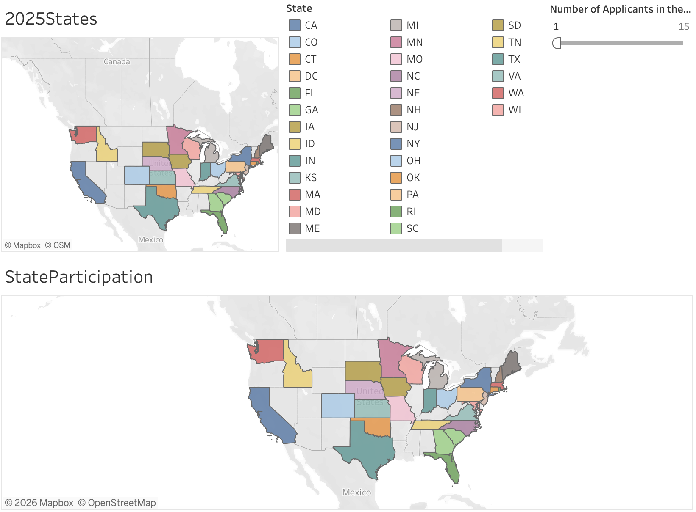

# KJF-Scholarship-Applicants-State-2025

Overview of 110 applications for the KJF scholarship in the year 2025.  
States with the most applicants (identified): 
1) Wisconsin - 15
2) Texas - 13
3) Florida - 9
4) Maryland - 7
5) (Tie) Minnesota & Pennsylvania - 6
